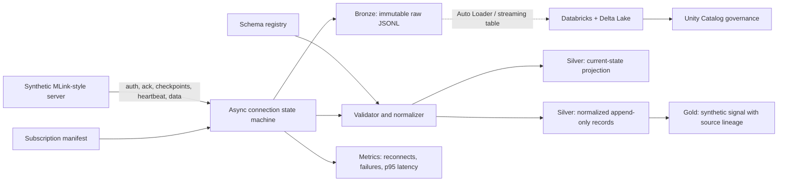

# Synthetic MLink-to-Databricks Lakehouse Reference

A portfolio-safe reference implementation for resilient, configuration-driven market-data streaming. It models the operational lifecycle of an MLink-style WebSocket connection and lands synthetic data into local **Bronze, Silver, current-state and Gold** layers. It also documents how the same contracts map to Databricks and Unity Catalog.

> This project is an independent educational reference. It does **not** connect to SpiderRock, contain proprietary SpiderRock schemas, use real credentials, reproduce a client strategy, or represent live trading experience. All message families, records and signals are synthetic.

## What this demonstrates

- Admin/authentication acknowledgement and stream acknowledgement
- `Begin → Active → Complete` bootstrap checkpoints
- Heartbeats, live records and deliberate network interruption
- Reconnect, reauthenticate and manifest-driven resubscription
- Versioned schema registry and subscription manifest
- Validation, event/current-state classification and deterministic keys
- Immutable raw messages, normalized records and latest current state
- Lineage-ready synthetic signal output
- Connection, recovery and processing-latency metrics including p95
- Zero-dependency Python core, tests, Docker packaging and Databricks examples

## Architecture



## Lifecycle

```text
CONNECT → AUTHENTICATE → SUBSCRIBE → BOOTSTRAP → STREAM
   ↑                                      │          │
   └──────── backoff / reconnect / reauth / resubscribe ─┘
```

The first synthetic connection deliberately fails. The pipeline reconnects, reauthenticates, rebuilds subscriptions from the manifest, receives a fresh bootstrap, and resumes. Raw messages retain their session and sequence so recovery is observable.

## Run locally

Requires Python 3.11+ and no third-party runtime dependencies.

```bash
PYTHONPATH=src python -m unittest discover -s tests -v
PYTHONPATH=src python -m mlink_lakehouse.cli \
  --schemas configs/schema_registry.json \
  --subscriptions configs/subscriptions.json \
  --output demo-output \
  --records 25 \
  --disconnect-after 8
```

Outputs:

```text
demo-output/
├── bronze/raw_messages.jsonl
├── silver/normalized_records.jsonl
├── silver/current_state.json
├── silver/seen_ids.txt
├── gold/signals.jsonl
└── metrics/run_report.json
```

Install as a command if preferred:

```bash
python -m pip install -e .
mlink-demo --output demo-output --records 25
```

## Run with Docker

```bash
docker build -t synthetic-mlink-lakehouse .
docker run --rm synthetic-mlink-lakehouse
```

The container runs as a non-root user and contains no secret or credential.

## Configuration-driven families

`configs/schema_registry.json` defines family type, version, primary key and required fields. `configs/subscriptions.json` defines the enabled families and symbol filters. Adding another synthetic family requires a schema plus a manifest entry rather than another collector process.

In a production design, changes would be reviewed in Git, validated in CI and deployed as a versioned bundle. Secrets would come from Databricks secret scopes or the cloud secret manager, never from these files.

## Lakehouse semantics

| Layer | Local reference | Databricks mapping |
|---|---|---|
| Bronze | Immutable envelope JSONL | Delta append-only raw table |
| Silver | Validated normalized records | Streaming table with schema enforcement |
| Current state | Newest event per family/key | MERGE or materialized projection |
| Gold | Synthetic midpoint plus full source pointer | Governed signal/feature table |
| Observability | JSON run report | Metrics/logs plus system tables/dashboard |

Every normalized record preserves event time, local receipt time, session, sequence, manifest version and schema version. Gold output points back to that exact source record. This makes reconstruction possible without implying that the synthetic midpoint is a useful trading strategy.

## Databricks deployment design

The reference supports two deployment shapes:

1. **Databricks-first:** run the persistent Python collector as a continuously supervised Databricks job, land raw data into a Unity Catalog Volume, and process with Auto Loader/Delta streaming tables.
2. **Hybrid (recommended for strict connection lifecycle control):** run the collector in a managed container service, land immutable messages in cloud object storage or a queue, then use Databricks for schema enforcement, current-state projection, features, analytics and governance.

Selection should follow a measured connectivity proof covering message rate, burst behavior, reconnect duration, latency target, cost and operational ownership.

`databricks/01_bronze_to_silver.py` is an illustrative notebook-export script. `databricks/job.example.yml` shows a job-resource skeleton. Environment-specific catalog, volume, cluster policy and cloud IAM configuration are intentionally left as deployment inputs.

## Reliability and verification

Automated tests cover:

- Schema validation and primary-key construction
- Rejection of a manifest referencing an unknown family
- Deliberate disconnect followed by successful reconnect
- Authentication and resubscription lifecycle
- Creation of Bronze, Silver, current-state, Gold and p95 metrics outputs

Production extensions should add real transport contract tests, load/soak testing, late/out-of-order record tests, queue backpressure, dead-letter handling, reconciliation reports, alert delivery tests and chaos tests for repeated disconnections.

## Security and scope boundaries

- No real vendor endpoint or API key is included.
- No proprietary schema, entitlement or strategy logic is included.
- The token in the mock server is a fixed synthetic test value.
- Outputs are demonstrations, not investment advice or trading recommendations.
- A real integration would require vendor authorization, reviewed credential handling, data licensing and environment-specific security controls.
